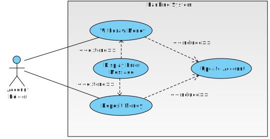

# <a name="top"></a>Bank Tech Test

[Test case scenario](#test) <br>
[Trello Board](#trello) <br>
[Use Case Diagram](#diag) <br>
[Use Case Specification](#spec) <br>
[User Stories](#stories) <br>
[Code Requirements](#reqs) <br>

### <a name="test"></a>Test Case Scenario :

**Given** a client makes a deposit of 1000 on 10-01-2012  
**And** a deposit of 2000 on 13-01-2012  
**And** a withdrawal of 500 on 14-01-2012  
**When** she prints her bank statement  
**Then** she would see

| date       | credit  | debit  | balance |
| ---        | ---     | ---    | ---     |
| 14/01/2012 |         | 500.00 | 2500.00 |
| 13/01/2012 | 2000.00 |        | 3000.00 |
| 10/01/2012 | 1000.00 |        | 1000.00 |


#### <a name="trello"></a>Trello Board :

https://trello.com/b/1ina1rpk/bank-tech-test


#### <a name="diag"></a>Use Case Diagram :




#### <a name="spec"/></a>Use Case Specification :

| Use Case Name  | Banking tech test |
| --- | --- |
| Summary Description | Allows a bank client to withdraw and deposit money from their bank account |
| Preconditions | The user must have a bank account |
| Post conditions | • On success, the account holder should be able to see a copy of their current bank statement<br>• The items on the bank statement should be in reverse chronological order<br>• The statement should include the account balance |
| Actors          | • Bank Client / Account Holder<br>• Banking System |
| Triggers        | • User opens an account<br>• User deposits money into their account<br>• User withdraws money from their account<br>• User prints bank statement |
| Main flow       |  |
| Extensions      |  |


#### <a name="stories"></a>User Stories :

```
As a user
So I can manage my personal finances
I'd like to open a current account
```

```
As an account holder
So I can add money to my account
I want to be able to make deposits
```

```
As an account holder
So I can buy things I like
I want to be able to withdraw money from my account
```

```
As an account holder
So I can see a record of my transactions
I want to print my bank statement
```

```
As an account holder
So I can see my most recent transactions first
I want to see my itemised statement in reverse chronological order
```

```
As an account holder
So I can see how much money is in my account
I want my statement to include the current balance after every transaction
```

```
As a bank
If an account holder tries to withdraw more than their balance
The bank will decline the transaction
```

### <a name="reqs"></a>Code Requirements :

* You should be able to interact with your code via a REPL like IRB or the JavaScript console.  (You don't need to implement a command line interface that takes input from STDIN.)
* Deposits, withdrawal.
* Account statement (date, amount, balance) printing.
* Data can be kept in memory (it doesn't need to be stored to a database or anything).


